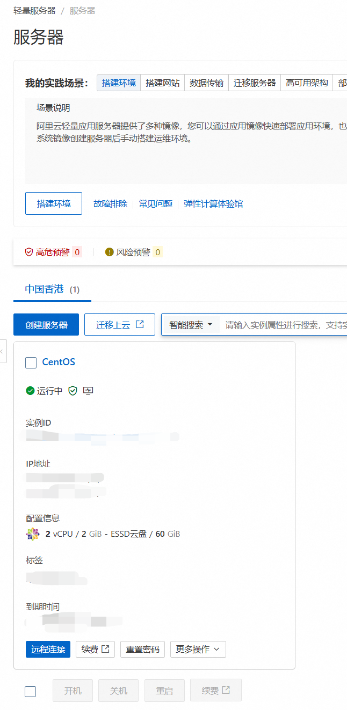
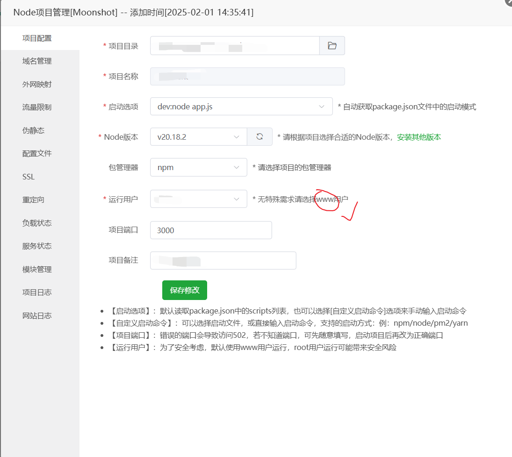
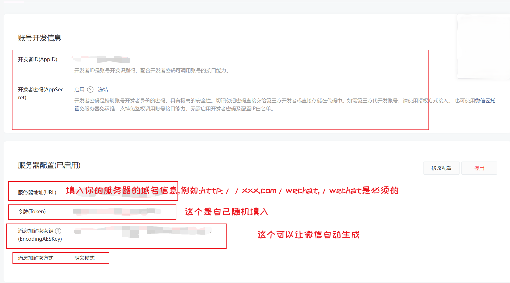

# ds-to-wechat


> 作者: `@SouthAki`
>
> 开源协议: `GPL-3.0`

## 项目介绍

> 一个将deepseek集成到自己微信公众号的项目

## 项目目标

- [x] 信息回复
- [ ] 多媒体回复
- [ ] Redis,根据上下文回复
- [ ] ....

## 使用方式

### 1. 必备环境

这里我用一台阿里云的轻量应用服务器,部署在中国香港,CentesOS环境,安装宝塔面板举例(或者你的可以运行Nodejs的本机,配上ddns方式也行,不过最好把服务器放在境外,这样后续如果有想引入OpenAI也可以)



然后需要一个域名,这里可以使用`cloudflare`进行域名解析(**一定要关闭代理模式,只让cloudflare仅DNS就行**)

然后,在你的面板里,安装Nodejs环境,我的是`v20.18.2`

### 2.配置

这边配置我以截图的方式



在初始化配置中,按照我上面进行设置

在域名管理部分,设置自己的域名信息,端口设置为**80**或者**443**

外网映射打开,OK服务器这一步搞定

微信公众平台上这样设置



### 3. 上传项目

把我的项目除了`public`文件夹,剩下下载存放在服务器上

然后需要引入`.env`文件

```text
DEEPSEEK_API_KEY=
DEEPSEEK_API_BASE_URL=https://api.deepseek.com/v1
MOONSHOT_API_KEY=
MOONSHOT_API_BASE_URL=https://api.moonshot.cn/v1
WECHAT_CONFIG_TOKEN=
WECHAT_CONFIG_APPID=
```

然后运行

```bash
npm i
```

或者在服务器上使用一键安装模块的方式

